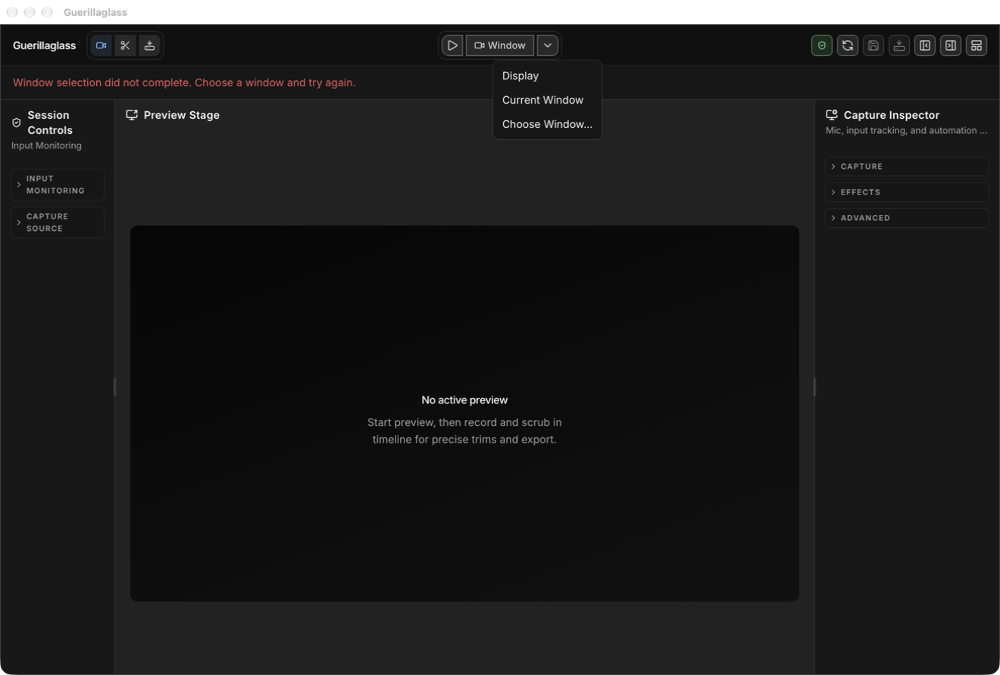
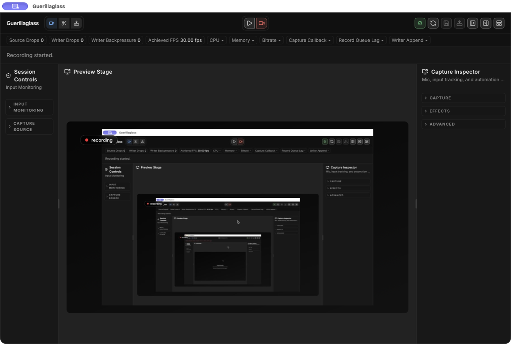
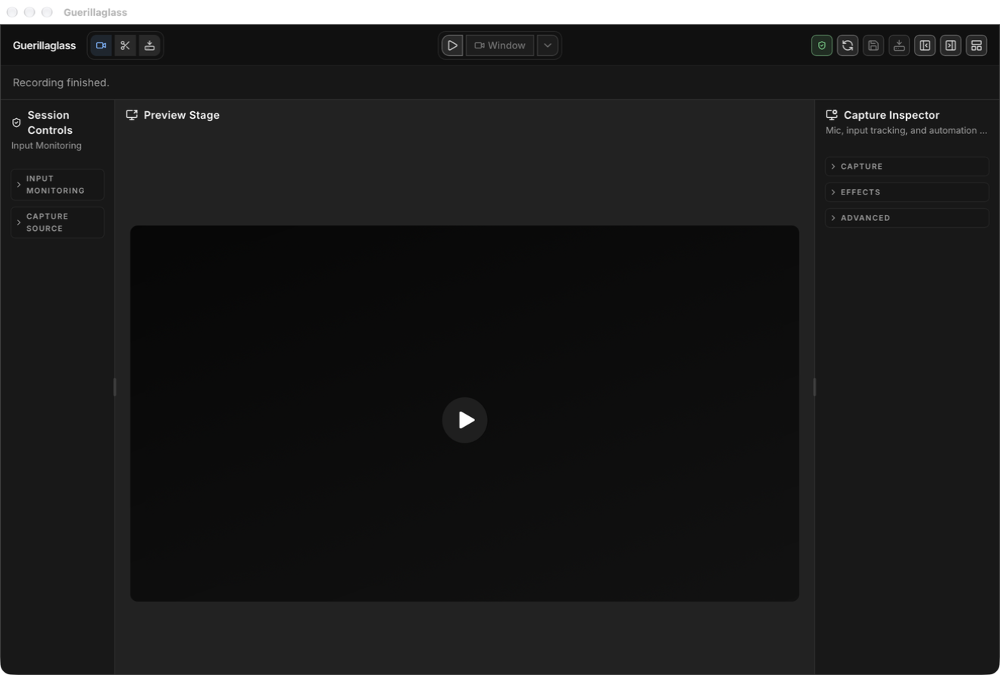

# Desktop capture permission repair

## Diagnosis

The direct launcher start made macOS attribute the engine's privacy requests to
T3. Launching the same app and engine through LaunchServices changed the
responsible process to the packaged Guerillaglass launcher and recording worked
with the existing app grant. The retained TCC log is
`.tmp/runtime-acceptance/capture-fix/tcc-attribution.log`.

The installed Electrobun 2.0.1 toolchain's
[Hutch v0.24.3 launcher code](https://github.com/blackboardsh/hutch/blob/v0.24.3/src/electrobun.zig#L4940)
directly spawns `Contents/MacOS/launcher`. The
[migration guide](https://framework.blackboard.sh/electrobun/guides/migrating-to-v2/)
allows retaining the Bun main process; this repair keeps that runtime and the
existing app identifier. A signing certificate was not required for the
successful same-binary control. Signing was an earlier hypothesis, not the
demonstrated blocker.

The Swift `sources.list` handler also unconditionally returned empty arrays.
It now enumerates ScreenCaptureKit displays/windows, uses the existing window
filter and capture capability calculations, and returns HTTP 403 when Screen
Recording permission is denied.

## Start and cleanup

`bun dev:hmr` in `apps/desktop-electrobun` builds the engine and bundle, launches
through `/usr/bin/open`, and passes the engine path explicitly. Vite and the app
share one scoped Effect runner. `concurrently` was removed because its process
tree termination interrupted the runner's cleanup.

The macOS adapter waits for the final Bun host registration. It uses the kernel
process start time, bundle URL, and PID to guard termination against PID reuse.
Short commands and each watched app instance have separate scopes. Cleanup runs
in an open scope, including interruption and failed readiness acquisition.

## Evidence

- Peekaboo's permissioned GUI bridge reported Screen Recording, Accessibility,
  and Event Synthesizing granted. The source dropdown contained real windows.
- Peekaboo started a current-window recording with Finder frontmost. The engine
  resolved Finder window 43, `dev-macos-arm64`; the native screenshot shows its
  live preview at 30 fps with zero reported source/writer drops.
- Peekaboo stopped recording and activated playback. AVFoundation decoded all
  1,063 frames of the 1840 x 872 recording, lasting 36.303 seconds.
- Native screenshots: `.tmp/runtime-acceptance/capture-sources-fixed.png`,
  `.tmp/runtime-acceptance/finder-recording-fixed.png`, and
  `.tmp/runtime-acceptance/finder-playback-fixed.png`. The MOV and decoded-frame
  report are retained in `.tmp/runtime-acceptance/capture-fix/`.
- `bun run desktop:acceptance` passed 37 browser tests and packaged runtime
  smoke. The final adapter also passed runtime smoke with `--skip-build`.
- HMR `Ctrl+C` and direct-runner SIGTERM stopped the app and engine. Process
  inspection found no surviving launcher, host, engine, or Vite process.
  Logs: `.tmp/desktop-hmr-lifecycle.log`, `.tmp/desktop-start-lifecycle.log`.
- Desktop typecheck, five Effect lifecycle tests, 13 focused Swift tests,
  Swift fast compile, repository checks/tests, formatting, and type-aware lint
  passed. The original empty-source handler made the denied-permission test
  fail; restoring the implementation made it pass again.

## Test claim ownership and limits

The new Effect tests own LaunchServices argument/environment forwarding,
preflight refusal, malformed identities, failed-start rollback, and interruption
cleanup. The new Swift test owns the denied-permission HTTP response. Neither
adds a test-only production seam or searches source text. Packaged GUI and media
decoding prove platform behavior that the deterministic lifecycle fixture cannot.

## Native picker repair

The host keeps the 20-second deadline for direct capture starts. A validated
`windowId: 0` request gets an 11-minute deadline because the native picker owns
a ten-minute selection deadline, followed by capture startup. Other requests,
including malformed payloads, retain their original deadlines. Swift closes the
picker and resumes its continuation on cancellation, stop, selection failure,
and deadline expiry. Request identities prevent an old cancellation/deadline task
from completing a replacement selection. The engine-client sends a bounded stop
request when a picker operation is interrupted. Toolbar capture callbacks use
React Query's `mutate`, so the existing `onError` handler owns rejection notices.

The lifecycle follows Swift's
[cancellation handler semantics](https://docs.swift.org/latest/documentation/swift/withtaskcancellationhandler%28operation%3Aoncancel%3A%29/)
and Apple's [observer removal API](https://developer.apple.com/documentation/screencapturekit/sccontentsharingpicker/remove%28_%3A%29).

### Picker evidence

- A deterministic Effect regression selects after 35 seconds. The original host
  failed at 20 seconds; the fix passes. Separate claims cover direct-start
  timeout/finalization/retry and abandoned-picker timeout/finalization.
- An engine-client interruption test verifies a stop request for the picker and
  no stop request for a direct-window start. Restoring the original service made
  this test fail, then restoring the repair made it pass.
- Peekaboo opened the packaged native picker, waited beyond 20 seconds, cancelled,
  and reopened it. Selection then completed after 32,040 ms, and recording started.
  Cancel returned the existing visible cancellation notice and re-enabled capture
  controls. The retained console contains no unhandled rejection or bridge timeout.
- Peekaboo stopped recording. AVFoundation decoded all 555 frames of the
  2640 x 1784 file, lasting 19.262 seconds. The file, console and decode report
  are in `.tmp/runtime-acceptance/picker-fix/`.
- Native screenshots: `.tmp/runtime-acceptance/picker-pending-over-20s.png`,
  `picker-cancelled-fixed.png`, `picker-retry-pending.png`,
  `picker-recording-fixed.png`, and `picker-stopped-fixed.png` in that directory's
  parent. These prove native interaction independently of mocked timers.

The native ten-minute deadline was compiled and reviewed, but was not awaited
for ten real minutes in GUI acceptance. The host deadline is tested with
`TestClock`. Microphone, export, notarization, and permissions across changed
signing identities were not retested. No full gate was run, as requested.

## Code-review corrections

Review compares `24b477e0327f2d3c6a7527c20b4ec63459075bcb` with the capture repair
commits. Standards and specification were reviewed by separate agents.

- A per-request observer now carries its selection identity into every callback.
  `CaptureStartupSession` owns the continuation, deadline, presentation teardown,
  and the request through startup. Stop after selection marks the request cancelled
  and retains ownership until startup cleanup finishes, preventing a replacement
  from acquiring shared stream/audio state too soon.
- Startup checks that ownership after every suspension. Microphone acquisition
  is inside the cleanup block, and stop resumes the pending startup continuation
  instead of dropping it. The existing weak recording-queue adapter handles the
  delayed activation task without claiming the entire engine is Sendable.
- Native picker cancellation/deadline failures get shared EN/DE selection notices.
  Typed screen/microphone denial uses the existing HTTP 403 `permission_denied`
  response and a separate localized permission notice. Runtime startup failures
  remain distinguishable; native diagnostic strings are not shown as picker notices.
- The repeated macOS helper path calculation has one owner.
- Three native lifecycle tests run without presenting system UI. Removing identity
  and stop validation made the retired-callback and post-selection-stop claims fail.
  Restoring the checks passed all 19 focused native tests. A renderer boundary test
  covers localized recovery and preserves unrelated error identities. No new
  test-only API, export, reset, clock override, or flag was introduced.

The final repaired bundle also passed Peekaboo cancellation after about 44 seconds,
reopening, window selection, recording, and stop. Shared notice text appeared in the
packaged app. AVFoundation decoded all 879 frames over 30.203 seconds. Final native
screenshots use the `picker-review-` prefix under `.tmp/runtime-acceptance/`; the
console, MOV, and decode report use `review-` under `picker-fix/`. No bridge timeout
or unhandled rejection appeared. The Swift fast build had no warnings.

The final specification follow-up found that direct display/window starts also
needed the startup owner. They now acquire the same session before permissions,
audio, or stream acquisition and validate it after every suspension. A cancelled
picker therefore blocks all replacement starts until cleanup finishes. The native
stop-after-selection claim also checks direct startup refusal and release after
cleanup. No wire schema or generated binding changed.

Stop itself also holds the shared owner while native stream teardown is suspended.
Failed starts await teardown before releasing their owner. Peekaboo verified direct
current-window recording, stop, immediate restart, and stop in the final bundle;
AVFoundation decoded all 304 frames of the restarted 10.433-second recording.
Native evidence uses `startup-direct-`/`startup-restart-` screenshot prefixes and
`direct-` media/log report names under the existing acceptance directories.

The user-selected full review baseline is
`b0a7e056abf64a5b67468e8300d5bb4b7491d413`. The earlier capture-only review used
`24b477e`; it does not substitute for the review of the larger requested diff.

## Full-baseline review acceptance

The [review from the requested baseline](2026-10-code-review.md) is complete with
zero open standards or specification findings. Its final capture correction
acquires the startup owner before the running-state shortcut, so a start during
suspended stop cannot report false success.

After unlocking macOS, Peekaboo used the permissioned bridge to open and cancel
the native picker, start current-window recording, stop, restart, and stop again
in the final packaged bundle. Cancellation restored the controls and displayed
the localized selection notice. Both live previews reported 30 fps with zero
source/writer drops. AVFoundation decoded all 451 frames of the restarted
3840 x 1942 recording over 15.395 seconds. Runner SIGTERM exited 130 and left no
app or engine process.

Final native screenshots use the `review-final-` prefix in
`.tmp/runtime-acceptance/`. The console, recording and decode report are
`picker-fix/final-console.log`, `picker-fix/final-restart.mov`, and
`picker-fix/final-media-check.json`. `bun run desktop:acceptance` separately passed
37 browser tests and packaged runtime smoke. This GUI interaction supplies the
native screenshot evidence unavailable to that runtime smoke.

### Retained PR screenshots

These are unedited captures from the permissioned Peekaboo bridge. The recording
screenshot is from the earlier picker selection acceptance; cancellation and
finished recording are from the final bundle acceptance.

